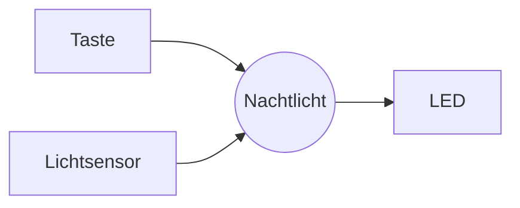

+++
title = "Woche 2 · Team, Anforderungen, Kanban"
weight = 2
+++

**Heute:** Du lernst die drei Grundbausteine jedes Programms kennen (Variablen, Verzweigungen, Schleifen), findest dein Team, wählt euer Board, schreibt auf, was euer Gadget können muss, und legt ein Kanban-Board an. Ab heute läuft **Sprint 1** (Woche 2–4).

{}
- Du kannst Eingaben in Zahlen umwandeln, mit `if`/`elif`/`else` entscheiden und mit `while` und `for` wiederholen.
- Du bist in einem Team (2–3 Personen) und ihr habt ein Board gewählt.
- Euer Team-Repository enthält eine Datei `ANFORDERUNGEN.md` mit User Stories.
- Euer Kanban-Board steht, die Karten für Sprint 1 sind ausgewählt.
- Journalauftrag 2 ist committet.
{}

## 1. Rückblick (5 min)

Zeig deiner Sitznachbarin oder deinem Sitznachbarn deine Gadget-Ideen aus [Journalauftrag 1]({}). Welche Idee hat die klarsten **Eingaben**, **Ausgaben** und **Zustände**?

## 2. Python-Werkstatt (30 min)

### 2a · Variablen und Datentypen · `thermostat.py`

Eine **Variable** ist ein Name für einen Wert. Der Wert hat einen **Datentyp**: `int` (ganze Zahl), `float` (Kommazahl), `str` (Text), `bool` (`True`/`False`).

`input()` liefert **immer Text**. Mit Text kann man nicht rechnen, deshalb wandelst du ihn um: `int(...)` oder `float(...)`.

```python
# Ein Thermostat entscheidet, ob geheizt wird
temperatur = float(input("Raumtemperatur in °C: "))
wunsch = 21.0

if temperatur < wunsch - 1:
    print("Heizung AN")
elif temperatur > wunsch + 1:
    print("Heizung AUS, Fenster auf?")
else:
    print("Passt. Heizung bleibt, wie sie ist.")

print("Abweichung:", round(temperatur - wunsch, 1), "°C")
```

**Probier aus:** Gib `18`, `21` und `23.5` ein. Dann gib `warm` ein. Lies die Fehlermeldung: Welche Zeile, welcher Fehler?

**Ändere es:**

1. Frag die Wunschtemperatur auch mit `input` ab.
2. Unter 5 °C soll zusätzlich `Frostschutz!` erscheinen.

{}
Die Reihenfolge der Bedingungen zählt: Python nimmt den **ersten** zutreffenden Zweig. Prüfe deshalb `temperatur < 5` **vor** `temperatur < wunsch - 1`, oder schreib ein eigenes `if` vor den ganzen Block.
{}

### 2b · Vergleichen und verknüpfen

| Ausdruck | Bedeutung |
|----------|-----------|
| `a == b`, `a != b` | gleich, ungleich (ein `=` allein ist eine **Zuweisung**) |
| `a < b`, `a <= b`, `a > b`, `a >= b` | kleiner, kleiner-gleich, … |
| `x and y` | beides wahr |
| `x or y` | mindestens eines wahr |
| `not x` | Gegenteil |

### 2c · Schleifen · `countdown.py`

`while` wiederholt, **solange** eine Bedingung gilt (kennst du aus `schalter.py`). `for` wiederholt **eine bestimmte Anzahl** von Malen oder für jedes Element einer Folge.

```python
import time

start = int(input("Countdown ab: "))

for sekunde in range(start, 0, -1):
    print(sekunde)
    time.sleep(1)

print("Los!")

# Blinkmuster: dreimal kurz, dann lang
for i in range(3):
    print("*", end=" ")
    time.sleep(0.3)
print("******")
```

`range(start, 0, -1)` zählt von `start` rückwärts bis **vor** 0, also bis 1. `range(3)` liefert 0, 1, 2.

**Ändere es:**

1. Bei den letzten drei Sekunden soll zusätzlich `Piep!` erscheinen.
2. Frag so lange nach dem Startwert, bis eine Zahl zwischen 1 und 60 eingegeben wird.

{}
```python
start = 0
while start < 1 or start > 60:
    start = int(input("Countdown ab (1–60): "))
```
{}

{}
Ein elektronischer Würfel ist ein beliebtes Gadget. Schreib ein Programm, das bei jedem Enter eine Zufallszahl von 1 bis 6 ausgibt und bei einer **Sechs** `Nochmal!` meldet. Nach 10 Würfen zeigt es, wie oft eine Sechs dabei war.

```python
import random
zahl = random.randint(1, 6)   # Zufallszahl von 1 bis 6
```
{}

Zum Nachschauen (Verzweigungen, dann beide Schleifenarten):





## Pause (5 min)

## 3. Team und Board (15 min)

**Teams:** 2–3 Personen. Bildet Teams rund um eine gemeinsame Gadget-Idee, nicht nur um Freundschaften. Die Lehrkraft hilft, wenn jemand übrig bleibt.

**Board:** Alle vier sind gleichwertig. Die Wahl hängt davon ab, was euer Gadget braucht.

| Board | Stärken | Gut für | Achtung |
|-------|---------|---------|---------|
| **micro:bit** (V2) | Tasten, 5×5-LED-Anzeige, Lautsprecher, Mikrofon, Licht-, Lage- und Temperatursensor schon eingebaut. Kein Stecken nötig. | schneller Start, Spiele, Schrittzähler, Würfel | wenig freie Anschlüsse, kein WLAN |
| **Raspberry Pi Pico** (W) | günstig, viele Anschlüsse, analoge Eingänge | Nachtlicht, Alarmanlage, alles mit Steckbrett | Sensoren und LEDs selbst anschließen. Nur die **Pico W** hat WLAN. |
| **ESP32** | WLAN und Bluetooth eingebaut, schnell | alles, was später ins Netz soll | Pinbelegung je nach Modell unterschiedlich |
| **Arduino** | robust, weit verbreitet | wenn das Board schon da ist | Der klassische **UNO R3** kann kein MicroPython: dann [Wokwi]({}) mit virtuellem ESP32 |

{}
In **P2 (Wetterstation)** schickt ihr Messwerte über WLAN. Mit **ESP32** oder **Pico W** könnt ihr euer Board dort weiterverwenden. Mit micro:bit ist P1 am einfachsten, für P2 braucht ihr dann ein zweites Board.
{}

**Team-Repository anlegen:** Eine Person legt auf GitHub ein **privates** Repository `p1-gadget-<teamname>` an (mit README), wie in [Git & GitHub]({}) Teil 2 „Selbst anlegen". Unter **Settings → Collaborators** die anderen Teammitglieder und die Lehrkraft einladen. Code, Anforderungen und Zustandsdiagramm liegen hier, dein **persönliches** Journal bleibt in deinem `lernjournal`.

## 4. Anforderungen: Was muss euer Gadget können? (25 min)

Bevor ihr baut, schreibt ihr auf, **was** das Gadget tun soll, nicht **wie**. Das verhindert, dass nach drei Wochen jedes Teammitglied an einem anderen Gerät baut.

### 4a · User Stories

Eine **User Story** beschreibt eine Anforderung aus Sicht einer Person, die das Gadget benutzt:

> **Als** *&lt;Rolle&gt;* **möchte ich** *&lt;Funktion&gt;*, **damit** *&lt;Nutzen&gt;*.

Zu jeder Story gehören **Akzeptanzkriterien**: überprüfbare Sätze, an denen ihr beim Review erkennt, ob die Story fertig ist.

Beispiel Nachtlicht:

```markdown
### US1 · Licht bei Dunkelheit (Muss)
Als Kind möchte ich, dass das Nachtlicht von selbst angeht, wenn es dunkel wird,
damit ich nachts nicht im Finstern aufstehen muss.

- [ ] Bei abgedeckter Hand über dem Sensor geht die LED innerhalb von 1 s an.
- [ ] Bei Tageslicht bleibt die LED aus.

### US2 · Ausschalten (Muss)
Als Elternteil möchte ich das Nachtlicht mit einer Taste ganz ausschalten,
damit es tagsüber keinen Strom braucht.

- [ ] Ein Tastendruck schaltet zwischen AUS und AUTOMATIK um.
- [ ] Im Zustand AUS leuchtet die LED nie, auch nicht bei Dunkelheit.

### US3 · Sanftes Ausgehen (Kann)
Als Kind möchte ich, dass das Licht langsam dunkler wird, damit ich nicht erschrecke.
```

**Muss / Soll / Kann** sagt, wie wichtig eine Story ist. Für Sprint 1 nehmt ihr nur **Muss**-Stories.

{}
- Sie beschreibt **ein** Verhalten, das man vorführen kann.
- Sie sagt nichts über Code oder Pins („Als Nutzer möchte ich eine `while`-Schleife" ist keine Story).
- Die Akzeptanzkriterien kann eine fremde Person prüfen, ohne euch zu fragen: „innerhalb von 1 s" statt „schnell".
{}



### 4b · Eingaben → Gadget → Ausgaben

Zeichnet dazu eine einfache Skizze: Was geht hinein, was kommt heraus? GitHub zeigt das sogar direkt als Grafik an, wenn ihr es als **Mermaid**-Block in eure Markdown-Datei schreibt:

````markdown

````


**Auftrag im Team:** Legt im Team-Repository `ANFORDERUNGEN.md` an mit

1. einem Satz, was euer Gadget ist,
2. der Skizze Eingaben → Gadget → Ausgaben,
3. **3–5 User Stories** mit Priorität und Akzeptanzkriterien.

## 5. Kanban-Board (10 min)

Ein **Kanban-Board** zeigt auf einen Blick, wer woran arbeitet und was fertig ist.

| Backlog | Sprint 1 | In Arbeit | Fertig |
|---------|----------|-----------|--------|
| alle Stories und Aufgaben | was ihr bis zum Review in Woche 4 schaffen wollt | was gerade jemand macht (mit Name) | Akzeptanzkriterien erfüllt |

Regeln:

1. **Eine Karte = eine Aufgabe**, klein genug für eine Stunde. Große Stories zerlegt ihr: „LED anschließen", „Sensorwert ausgeben", „Schwellwert finden".
2. **Höchstens eine Karte pro Person** in „In Arbeit" (WIP-Limit). Erst fertig machen, dann Neues anfangen.
3. **Fertig** heißt: die Akzeptanzkriterien sind erfüllt, nicht „fast".
4. Jede Stunde beginnt mit einem **Stand-up** (3 min) vor dem Board: Was habe ich gemacht? Was mache ich heute? Wo hänge ich?

Wo das Board lebt, entscheidet ihr: **Papier/Haftnotizen** (Foto am Stundenende ins Repository) oder digital als **GitHub Project** im Team-Repository (Reiter **Projects → New project → Board**).



## 6. Journalauftrag 2 (10 min)

Lege in **deinem** Lernjournal `p1/woche-02.md` an und verlinke es in der `README.md`.

{}
```markdown
# P1 · Woche 2 · <Datum>

## Team und Gadget
Mit wem bist du im Team? Was baut ihr (ein Satz)?
Welches Board, und warum dieses und kein anderes?

## Meine Aufgaben in Sprint 1
Welche Karten vom Kanban-Board übernimmst du?

## Python
Ein Ding, das ich heute verstanden habe (mit einem Codebeispiel).
Ein Ding, das mir noch unklar ist.

## Beleg
Foto vom Kanban-Board oder Screenshot von thermostat.py mit deiner Änderung.
Link zu ANFORDERUNGEN.md im Team-Repository.
```
{}

Commit-Nachricht: `P1 Woche 2: Team, Plan, Python`.

## Quiz



Was passiert bei diesem Code, wenn du `15` eingibst?

```python
alter = input("Alter? ")
print(alter + 1)
```
---
Es wird `16` ausgegeben.
Es wird `151` ausgegeben.
Es gibt einen Fehler.
Es wird `15` ausgegeben.
---
`input` liefert Text (`"15"`). Text und Zahl kann Python nicht addieren (`TypeError`). Richtig wäre `alter = int(input("Alter? "))`.


Welche Zahlen gibt `for i in range(3): print(i)` aus?
---
1, 2, 3
0, 1, 2
0, 1, 2, 3
3, 2, 1
---
`range(3)` beginnt bei 0 und endet **vor** 3.


`temperatur = 22`. Was gibt das Programm aus?

```python
if temperatur > 25:
    print("heiß")
elif temperatur > 18:
    print("angenehm")
else:
    print("kalt")
```
---
heiß
angenehm
kalt
angenehm und kalt
---
22 > 25 ist falsch, 22 > 18 ist wahr. Nach dem ersten zutreffenden Zweig ist Schluss.


Welche ist eine gute User Story?
---
Das Gadget soll gut sein.
Als Programmierer möchte ich eine `while`-Schleife verwenden.
Wir bauen einen Summer an Pin 15.
Als Läuferin möchte ich meine Schritte sehen, damit ich weiß, ob ich mein Tagesziel erreicht habe.
---
Sie nennt Rolle, Funktion und Nutzen, und sie sagt nichts über die technische Umsetzung.


Wozu dient das WIP-Limit („höchstens eine Karte pro Person in Arbeit")?
---
Damit Aufgaben fertig werden, statt dass vieles halb angefangen herumliegt.
Damit niemand zu viel arbeitet.
Damit die Lehrkraft weniger kontrollieren muss.
Damit das Board übersichtlich aussieht.
---
Halb fertige Aufgaben kann man beim Review nicht vorführen. Das Limit zwingt dazu, eine Sache abzuschließen, bevor die nächste beginnt.



## Bis nächste Woche

- `ANFORDERUNGEN.md` im Team fertigstellen, Kanban-Board mit Karten für Sprint 1 füllen.
- Journalauftrag 2 committen.
- Wer Hardware zu Hause hat: [MicroPython-Boards]({}) durchlesen und das Board mit Thonny verbinden. Ohne Hardware: [Wokwi]({}) oder [python.microbit.org](https://python.microbit.org/) öffnen.
