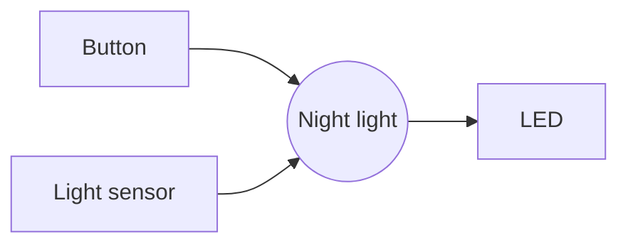

+++
title = "Week 2 · Team, Requirements, Kanban"
weight = 2
+++

**Today:** you learn the three building blocks of every program (variables, branching, loops), find your team, choose your board, write down what your gadget must be able to do, and set up a Kanban board. **Sprint 1** starts today (weeks 2–4).

{}
- You can convert input into numbers, decide with `if`/`elif`/`else` and repeat with `while` and `for`.
- You are in a team (2–3 people) and you have chosen a board.
- Your team repository contains a file `REQUIREMENTS.md` with user stories.
- Your Kanban board is set up and the cards for sprint 1 are selected.
- Journal task 2 is committed.
{}

## 1. Look back (5 min)

Show the person next to you your gadget ideas from [journal task 1]({}). Which idea has the clearest **inputs**, **outputs** and **states**?

## 2. Python workshop (30 min)

### 2a · Variables and data types · `thermostat.py`

A **variable** is a name for a value. The value has a **data type**: `int` (whole number), `float` (decimal number), `str` (text), `bool` (`True`/`False`).

`input()` **always returns text**. You cannot calculate with text, so you convert it: `int(...)` or `float(...)`.

```python
# A thermostat decides whether to heat
temperature = float(input("Room temperature in °C: "))
target = 21.0

if temperature < target - 1:
    print("Heating ON")
elif temperature > target + 1:
    print("Heating OFF, open a window?")
else:
    print("Fine. Heating stays as it is.")

print("Difference:", round(temperature - target, 1), "°C")
```

**Try it:** enter `18`, `21` and `23.5`. Then enter `warm`. Read the error message: which line, which error?

**Change it:**

1. Ask for the target temperature with `input` as well.
2. Below 5 °C, `Frost protection!` should also appear.

{}
The order of the conditions matters: Python takes the **first** branch that matches. So check `temperature < 5` **before** `temperature < target - 1`, or write a separate `if` before the whole block.
{}

### 2b · Comparing and combining

| Expression | Meaning |
|------------|---------|
| `a == b`, `a != b` | equal, not equal (a single `=` is an **assignment**) |
| `a < b`, `a <= b`, `a > b`, `a >= b` | less than, less than or equal, … |
| `x and y` | both true |
| `x or y` | at least one true |
| `not x` | the opposite |

### 2c · Loops · `countdown.py`

`while` repeats **as long as** a condition holds (you know it from `switch.py`). `for` repeats **a given number** of times or once for each element of a sequence.

```python
import time

start = int(input("Count down from: "))

for second in range(start, 0, -1):
    print(second)
    time.sleep(1)

print("Go!")

# Blink pattern: three short, then long
for i in range(3):
    print("*", end=" ")
    time.sleep(0.3)
print("******")
```

`range(start, 0, -1)` counts backwards from `start` to **just before** 0, so down to 1. `range(3)` gives 0, 1, 2.

**Change it:**

1. For the last three seconds, `Beep!` should appear as well.
2. Keep asking for the start value until a number between 1 and 60 is entered.

{}
```python
start = 0
while start < 1 or start > 60:
    start = int(input("Count down from (1–60): "))
```
{}

{}
An electronic dice is a popular gadget. Write a program that prints a random number from 1 to 6 every time you press Enter and says `Again!` on a **six**. After 10 throws it shows how many sixes there were.

```python
import random
number = random.randint(1, 6)   # random number from 1 to 6
```
{}

To rewatch (German: branching, then both kinds of loops):





## 3. Team and board (15 min)

**Teams:** 2–3 people. Form teams around a shared gadget idea, not just around friendships. Your teacher helps if someone is left over.

**Board:** all four are equally valid. The choice depends on what your gadget needs.

| Board | Strengths | Good for | Watch out |
|-------|-----------|----------|-----------|
| **micro:bit** (V2) | buttons, 5×5 LED display, speaker, microphone, light, motion and temperature sensor built in. No wiring needed. | quick start, games, step counter, dice | few free connectors, no Wi-Fi |
| **Raspberry Pi Pico** (W) | cheap, many pins, analog inputs | night light, alarm system, anything on a breadboard | connect sensors and LEDs yourself. Only the **Pico W** has Wi-Fi. |
| **ESP32** | Wi-Fi and Bluetooth built in, fast | anything that should go online later | pinout differs between models |
| **Arduino** | robust, widespread | if the board is already there | the classic **UNO R3** cannot run MicroPython: then use [Wokwi]({}) with a virtual ESP32 |

{}
In **P2 (weather station)** you send measurements over Wi-Fi. With an **ESP32** or **Pico W** you can keep using your board there. The micro:bit makes P1 easiest, but for P2 you will then need a second board.
{}

**Create the team repository:** one person creates a **private** repository `p1-gadget-<teamname>` on GitHub (with README), as in [Git & GitHub]({}) part 2 "create it yourself". Under **Settings → Collaborators** invite the other team members and the teacher. Code, requirements and state diagram live here; your **personal** journal stays in your `lernjournal`.

## 4. Requirements: what must your gadget be able to do? (25 min)

Before you build, you write down **what** the gadget should do, not **how**. That prevents each team member from building a different device after three weeks.

### 4a · User stories

A **user story** describes a requirement from the point of view of a person who uses the gadget:

> **As** *&lt;role&gt;* **I want** *&lt;feature&gt;* **so that** *&lt;benefit&gt;*.

Each story comes with **acceptance criteria**: checkable sentences that tell you at the review whether the story is done.

Example night light:

```markdown
### US1 · Light when it is dark (must)
As a child I want the night light to switch on by itself when it gets dark,
so that I do not have to get up in the dark at night.

- [ ] With a hand covering the sensor, the LED switches on within 1 s.
- [ ] In daylight the LED stays off.

### US2 · Switch off (must)
As a parent I want to switch the night light off completely with a button,
so that it uses no power during the day.

- [ ] One button press toggles between OFF and AUTOMATIC.
- [ ] In the OFF state the LED never lights up, not even in the dark.

### US3 · Fade out gently (could)
As a child I want the light to dim slowly so that I do not get startled.
```

**Must / should / could** says how important a story is. For sprint 1 you only take **must** stories.

{}
- It describes **one** behaviour that can be demonstrated.
- It says nothing about code or pins ("As a user I want a `while` loop" is not a story).
- A stranger can check the acceptance criteria without asking you: "within 1 s" instead of "fast".
{}

German video on user stories:



### 4b · Inputs → gadget → outputs

Add a simple sketch: what goes in, what comes out? GitHub even shows it as a graphic if you write it as a **Mermaid** block in your Markdown file:

````markdown

````


**Team task:** create `REQUIREMENTS.md` in the team repository with

1. one sentence saying what your gadget is,
2. the sketch inputs → gadget → outputs,
3. **3–5 user stories** with priority and acceptance criteria.

## 5. Kanban board (10 min)

A **Kanban board** shows at a glance who is working on what and what is done.

| Backlog | Sprint 1 | In progress | Done |
|---------|----------|-------------|------|
| all stories and tasks | what you want to finish by the review in week 4 | what someone is doing right now (with name) | acceptance criteria met |

Rules:

1. **One card = one task**, small enough for one lesson. Split big stories: "connect LED", "print sensor value", "find threshold".
2. **At most one card per person** in "in progress" (WIP limit). Finish first, then start something new.
3. **Done** means: the acceptance criteria are met, not "almost".
4. Every lesson starts with a **stand-up** (3 min) in front of the board: What did I do? What am I doing today? Where am I stuck?

You decide where the board lives: **paper/sticky notes** (photo into the repository at the end of the lesson) or digitally as a **GitHub Project** in the team repository (tab **Projects → New project → Board**).

German video on Kanban:



## 6. Journal task 2 (10 min)

Create `p1/woche-02.md` in **your** learning journal and link it in the `README.md`.

{}
```markdown
# P1 · Week 2 · <date>

## Team and gadget
Who is in your team? What are you building (one sentence)?
Which board, and why this one and not another?

## My tasks in sprint 1
Which cards from the Kanban board are you taking?

## Python
One thing I understood today (with a code example).
One thing that is still unclear to me.

## Evidence
Photo of the Kanban board or screenshot of thermostat.py with your change.
Link to REQUIREMENTS.md in the team repository.
```
{}

Commit message: `P1 week 2: team, plan, Python`.

## Quiz



What happens with this code if you enter `15`?

```python
age = input("Age? ")
print(age + 1)
```
---
It prints `16`.
It prints `151`.
There is an error.
It prints `15`.
---
`input` returns text (`"15"`). Python cannot add text and a number (`TypeError`). Correct would be `age = int(input("Age? "))`.


Which numbers does `for i in range(3): print(i)` print?
---
1, 2, 3
0, 1, 2
0, 1, 2, 3
3, 2, 1
---
`range(3)` starts at 0 and ends **before** 3.


`temperature = 22`. What does the program print?

```python
if temperature > 25:
    print("hot")
elif temperature > 18:
    print("pleasant")
else:
    print("cold")
```
---
hot
pleasant
cold
pleasant and cold
---
22 > 25 is false, 22 > 18 is true. After the first matching branch, the block is finished.


Which one is a good user story?
---
The gadget should be good.
As a programmer I want to use a `while` loop.
We build a buzzer on pin 15.
As a runner I want to see my steps so that I know whether I reached my daily goal.
---
It names role, feature and benefit, and says nothing about the technical implementation.


What is the WIP limit ("at most one card per person in progress") for?
---
So that tasks get finished instead of lots of things lying around half done.
So that nobody works too much.
So that the teacher has less to check.
So that the board looks tidy.
---
Half-finished tasks cannot be demonstrated at the review. The limit makes you finish one thing before starting the next.



## Until next week

- Finish `REQUIREMENTS.md` as a team, fill the Kanban board with cards for sprint 1.
- Commit journal task 2.
- If you have hardware at home: read [MicroPython Boards]({}) and connect the board to Thonny. Without hardware: open [Wokwi]({}) or [python.microbit.org](https://python.microbit.org/).
