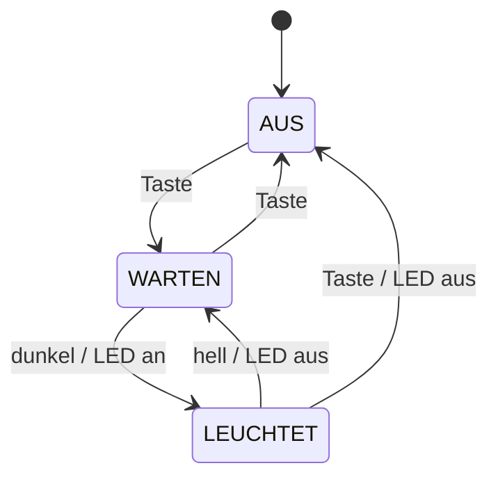
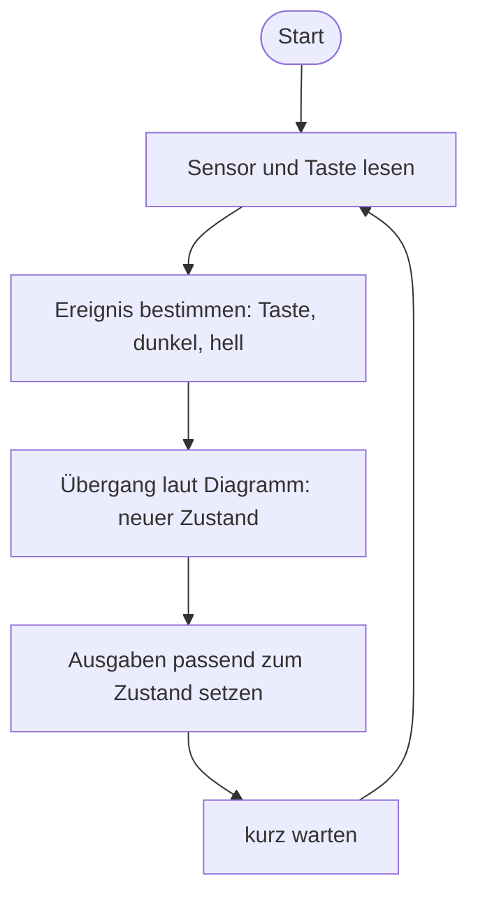
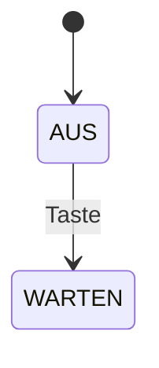

+++
title = "Woche 4 · Sensoren, Zustandsdiagramm, Sprint-Review"
weight = 4
+++

**Heute:** Euer Gadget bekommt Sinne (Sensor) und eine Stimme (Aktor). Ihr zeichnet, in welchen **Zuständen** es sich befinden kann, und zeigt euren Stand im **Sprint-Review 1**.

{}
- Euer Board hat eine Datei `hardware.py`: Alles, was vom Board abhängt, steckt darin.
- Du hast Sensorwerte live im Plotter gesehen und einen Schwellwert bestimmt.
- Euer Team hat ein **Zustandsdiagramm** und einen **Ablaufplan** des Gadgets.
- Ihr habt beim Sprint-Review vorgeführt, Feedback bekommen und den Backlog für Sprint 2 angepasst.
{}

## 1. Stand-up (5 min)

Wie immer vor dem Board. Zusätzlich: **Was zeigen wir heute beim Review?** Eine Person bereitet die Vorführung vor.

## 2. Die Hardware-Schicht · `hardware.py` (15 min)

Letzte Woche stand in jedem Programm board-spezifischer Code (`Pin(14, …)`, `display.show(…)`). Ab heute trennt ihr das sauber:

- **`hardware.py`** enthält kleine Funktionen wie `helligkeit()`, `led(an)`, `ton(…)`, `gedrueckt()`. Nur diese Datei ist je Board verschieden.
- **`main.py`** und alle weiteren Programme verwenden nur diese Funktionen. Sie sind für **alle Boards gleich**.

Speichere die passende Datei in Thonny als `hardware.py` **auf das Board** (Datei → Speichern unter → MicroPython-Gerät). Ihr braucht nur die Funktionen, die euer Gadget verwendet. Einen anderen Sensor (Abstand, Bewegung, Temperatur) baut ihr genauso ein: eine Funktion, die eine Zahl liefert. Anschlusspläne für weitere Bauteile: [MicroPython-Boards]({}).


{}
**Aufbau:** nichts, alles eingebaut (micro:bit **V2** für den Ton). Die LED-Anzeige misst gleichzeitig die Helligkeit. Leuchtet sie gerade, stört das die Messung ein wenig.

```python
# hardware.py – micro:bit V2
from microbit import *
import music


def helligkeit():
    """Umgebungslicht in Prozent (0 = dunkel, 100 = hell)."""
    return display.read_light_level() * 100 // 255


def neigung():
    """Neigung nach links/rechts, ungefähr -100 bis 100."""
    return accelerometer.get_x() // 10


def led(an):
    if an:
        display.show(Image.HEART)
    else:
        display.clear()


def ton(frequenz, dauer_ms):
    music.pitch(frequenz, dauer_ms)


def gedrueckt():
    """True einmal pro Druck auf Taste A."""
    return button_a.was_pressed()
```
{}
{}
**Aufbau** (USB abgezogen):

| Bauteil | Anschluss |
|---------|-----------|
| Taste | GP14 ↔ GND |
| LED + 220 Ω | GP15 → Widerstand → LED (langes Bein) → GND |
| Passiver Summer (Piezo) | GP16 ↔ GND |
| Lichtsensor (LDR) + 10 kΩ | 3V3 → LDR → **GP26** → 10 kΩ → GND |

Statt des Lichtsensors geht auch ein **Potentiometer** (Außenbeine an 3V3 und GND, Mitte an GP26).

```python
# hardware.py – Raspberry Pi Pico
from machine import Pin, ADC, PWM
import time

_taste = Pin(14, Pin.IN, Pin.PULL_UP)
_led = Pin(15, Pin.OUT)
_summer = PWM(Pin(16))
_summer.freq(1000)
_summer.duty_u16(0)
_sensor = ADC(26)
_vorher = 1


def helligkeit():
    """Umgebungslicht in Prozent (0 = dunkel, 100 = hell)."""
    return _sensor.read_u16() * 100 // 65535


def led(an):
    _led.value(1 if an else 0)


def ton(frequenz, dauer_ms):
    _summer.freq(frequenz)
    _summer.duty_u16(32768)            # halbe Periode an = lautester Ton
    time.sleep_ms(dauer_ms)
    _summer.duty_u16(0)


def gedrueckt():
    """True einmal pro Druck (Flankenerkennung)."""
    global _vorher
    jetzt = _taste.value()
    neu = _vorher == 1 and jetzt == 0
    _vorher = jetzt
    return neu
```
{}
{}
**Aufbau** (USB abgezogen):

| Bauteil | Anschluss |
|---------|-----------|
| Taste | GPIO 4 ↔ GND |
| LED + 220 Ω | GPIO 18 → Widerstand → LED (langes Bein) → GND (oder Onboard-LED GPIO 2) |
| Passiver Summer (Piezo) | GPIO 19 ↔ GND |
| Lichtsensor (LDR) + 10 kΩ | 3V3 → LDR → **GPIO 34** → 10 kΩ → GND |

Statt des Lichtsensors geht auch ein **Potentiometer** (Außenbeine an 3V3 und GND, Mitte an GPIO 34).

```python
# hardware.py – ESP32
from machine import Pin, ADC, PWM
import time

_taste = Pin(4, Pin.IN, Pin.PULL_UP)
_led = Pin(18, Pin.OUT)
_summer = PWM(Pin(19))
_summer.freq(1000)
_summer.duty_u16(0)
_sensor = ADC(Pin(34))
_sensor.atten(ADC.ATTN_11DB)           # voller Bereich 0–3,3 V
_vorher = 1


def helligkeit():
    """Umgebungslicht in Prozent (0 = dunkel, 100 = hell)."""
    return _sensor.read_u16() * 100 // 65535


def led(an):
    _led.value(1 if an else 0)


def ton(frequenz, dauer_ms):
    _summer.freq(frequenz)
    _summer.duty_u16(32768)
    time.sleep_ms(dauer_ms)
    _summer.duty_u16(0)


def gedrueckt():
    """True einmal pro Druck (Flankenerkennung)."""
    global _vorher
    jetzt = _taste.value()
    neu = _vorher == 1 and jetzt == 0
    _vorher = jetzt
    return neu
```
{}
{}
**UNO R4 / Nano ESP32 mit MicroPython:** ESP32-Datei verwenden, Pinnummern laut Pinout auf [MicroPython-Boards]({}) anpassen. Die Funktionsnamen bleiben gleich, dann läuft der restliche Code unverändert.
**UNO R3:** [Wokwi]({}) mit ESP32 und derselben Verkabelung.
{}


Der Unterstrich vor `_taste`, `_led` … bedeutet: nur für den Gebrauch **innerhalb** von `hardware.py`.

## 3. Sensor erkunden · `sensor_test.py` (10 min)

Dieses Programm ist für alle Boards gleich:

```python
from hardware import *
import time

while True:
    print(helligkeit())
    time.sleep_ms(200)
```

Starte es und öffne in Thonny **Ansicht → Plotter**. Deck den Sensor mit der Hand ab, leuchte mit dem Handy darauf.

**Bestimme im Team:** Welcher Wert ist „hell" (Tageslicht im Raum), welcher „dunkel" (Hand drüber)? Wählt einen **Schwellwert** dazwischen und notiert ihn.

## 4. Sensor steuert Aktor · `nachtlicht_einfach.py` (10 min)

```python
from hardware import *
import time

SCHWELLE = 30          # euer Wert aus Teil 3


def ist_dunkel(wert):
    return wert < SCHWELLE


while True:
    led(ist_dunkel(helligkeit()))
    time.sleep_ms(100)
```

**Probier aus und beobachte:**

1. Halte die Hand langsam über den Sensor, genau an der Grenze. Was macht die LED?
2. Wie würdest du das Nachtlicht **ganz ausschalten**, wenn du es nicht brauchst?

Frage 2 kann dieses Programm nicht lösen: Es kennt keine **Zustände**. Es macht immer dasselbe, egal was vorher war. Dafür braucht ihr ein Modell.

{}
Die LED flackert. Der Messwert schwankt um den Schwellwert herum, jeder kleine Ausschlag schaltet um. Nächste Woche untersucht ihr, wie man das verhindert.
{}

## 5. Zustandsdiagramm und Ablaufplan (15 min)

### 5a · Zustandsdiagramm: *In welchem Zustand ist das Gerät?*

Ein **Zustandsdiagramm** zeigt

- **Zustände** (abgerundete Kästen): Situationen, in denen sich das Gerät gleich verhält,
- **Übergänge** (Pfeile): *Ereignis / Aktion*, z. B. `Taste / LED aus`,
- den **Startzustand** (Pfeil vom schwarzen Punkt).

Das Nachtlicht mit Aus-Taste:



Prüfe das Diagramm: Gibt es für jeden Zustand eine Antwort auf jedes Ereignis? Was passiert im Zustand AUS, wenn es dunkel wird? (Nichts. Ein fehlender Pfeil heißt: Der Zustand bleibt.)



### 5b · Ablaufplan: *Was tut das Programm, Schritt für Schritt?*

Das Zustandsdiagramm sagt, **was** das Gerät tut. Der **Ablaufplan** zeigt, **wie** die Hauptschleife das umsetzt. Beide braucht ihr: Das eine modelliert das Gerät, das andere das Programm.



**Auftrag im Team:** Zeichnet das Zustandsdiagramm **eures** Gadgets, zuerst auf Papier. Legt es im Team-Repository als `ZUSTANDSDIAGRAMM.md` ab, entweder als Foto oder als Mermaid-Block (GitHub zeigt ihn als Grafik an):

````markdown

````

{}
- Jeder Zustand hat einen Namen, der eine **Situation** beschreibt (WARTEN, LEUCHTET), keine Tätigkeit des Programms (SENSOR_LESEN).
- Genau ein Startzustand.
- Jeder Pfeil ist mit einem **Ereignis** beschriftet.
- Von jedem Zustand kommt man wieder weg (keine Sackgasse, außer das ist gewollt).
- Eine Person, die euer Gerät nicht kennt, kann anhand des Diagramms vorhersagen, was ein Tastendruck bewirkt.
{}

## 6. Sprint-Review 1 (35 min)

Das **Sprint-Review** ist eine Zwischenpräsentation: Ihr zeigt, was **läuft**, nicht was ihr vorhabt. Das Publikum sind eure Mitschüler:innen, sie geben Feedback wie Kund:innen.

**Pro Team 4 Minuten:**

| Zeit | Inhalt |
|------|--------|
| 2 min | **Demo** am Board: welche User Stories sind fertig? Akzeptanzkriterien laut vorlesen und vorführen. |
| 1 min | **Zustandsdiagramm** zeigen: So soll das fertige Gadget funktionieren. |
| 1 min | **Feedback** aus der Klasse |

**Feedback geben** (kurz, freundlich, konkret):

- *Mir gefällt …*
- *Ich frage mich …*
- *Wie wäre es, wenn …*

**Nach allen Vorführungen (5 min im Team):** Feedback auf neue Karten schreiben, Backlog neu sortieren, Karten für **Sprint 2** (Woche 5–6) auswählen. Unfertiges aus Sprint 1 wandert zurück in den Backlog, nicht automatisch in Sprint 2.

## 7. Journalauftrag 4 (5 min, Rest zu Hause)

{}
```markdown
# P1 · Woche 4 · <Datum>

## Unser Modell
Zustandsdiagramm eures Gadgets (Foto oder Mermaid-Block).
Erkläre einen Übergang in eigenen Worten:
„Im Zustand … führt … dazu, dass …"

## Sensor
Welcher Sensor, welcher Schwellwert, wie habt ihr ihn gefunden?

## Feedback aus dem Review
Das wichtigste Feedback, das ihr bekommen habt,
und was ihr in Sprint 2 deshalb ändert.
```
{}

Commit-Nachricht: `P1 Woche 4: Zustandsdiagramm und Review`.

## Quiz



Warum steckt der board-spezifische Code in `hardware.py`?
---
Weil MicroPython nur zwei Dateien erlaubt.
Damit der restliche Code auf allen Boards gleich bleibt und man das Board wechseln kann, ohne alles umzuschreiben.
Damit das Programm schneller startet.
Weil `main.py` keine Imports enthalten darf.
---
Nur die Hardware-Schicht muss angepasst werden. Das Prinzip heißt **Abstraktion**: Der Rest des Programms fragt nur „wie hell ist es?", nicht „welcher Pin, welcher Wertebereich?".


Welcher dieser Namen ist ein guter **Zustand** für ein Zustandsdiagramm?
---
`SENSOR_LESEN`
`WHILE_SCHLEIFE`
`ALARM_AKTIV`
`LED_AN_SCHALTEN`
---
Ein Zustand beschreibt eine Situation des Geräts, die eine Weile andauert. Die anderen sind Tätigkeiten oder Programmteile.


Im Diagramm oben: Das Nachtlicht ist im Zustand **AUS** und es wird dunkel. Was passiert?
---
Nichts, es bleibt im Zustand AUS.
Es wechselt nach LEUCHTET.
Es wechselt nach WARTEN.
Das Diagramm ist fehlerhaft.
---
Von AUS gibt es keinen Pfeil mit „dunkel". Ein fehlender Übergang bedeutet: Der Zustand bleibt gleich.


Was ist der Unterschied zwischen Zustandsdiagramm und Ablaufplan?
---
Es gibt keinen, das sind zwei Namen für dasselbe.
Der Ablaufplan zeigt die Zustände, das Zustandsdiagramm den Code.
Das Zustandsdiagramm ist für Python, der Ablaufplan für MicroPython.
Das Zustandsdiagramm modelliert, wie sich das Gerät verhält. Der Ablaufplan zeigt, in welcher Reihenfolge das Programm arbeitet.
---
Zustandsbasiert (das Gerät) und ablauforientiert (das Programm) sind zwei Blickwinkel auf dasselbe System.


Was gehört beim Sprint-Review in die Vorführung?
---
Alles, was ihr bis zum Projektende noch bauen wollt.
Was jetzt schon funktioniert, gemessen an den Akzeptanzkriterien.
Der gesamte Quellcode, Zeile für Zeile.
Nur Folien, damit nichts schiefgehen kann.
---
Das Review zeigt fertige Stories am echten Gerät. Pläne gehören in den Backlog.



## Bis nächste Woche

- Journalauftrag 4 committen.
- `ZUSTANDSDIAGRAMM.md` im Team-Repository fertigstellen: Nächste Woche wird es zu Code.
- Wer mag, zum Anschauen: Wie reagiert ein Sensor, und wie programmiert man ihn (am micro:bit gezeigt, gilt für alle Boards)?


