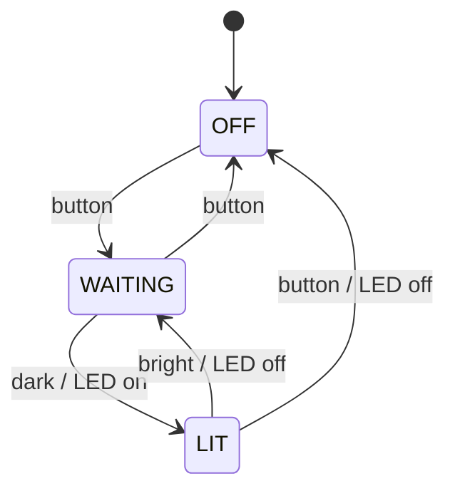
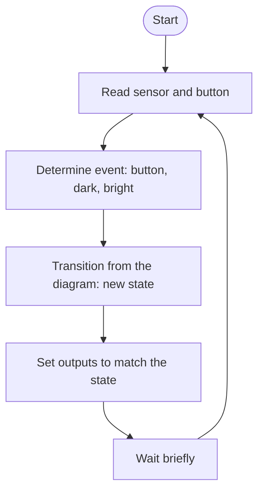
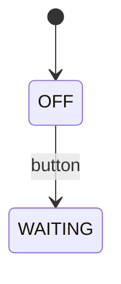

+++
title = "Week 4 · Sensors, State Diagram, Sprint Review"
weight = 4
+++

**Today:** your gadget gets senses (sensor) and a voice (actuator). You draw which **states** it can be in, and you show your progress at **sprint review 1**.

{}
- Your board has a file `hardware.py`: everything that depends on the board is inside it.
- You have watched sensor values live in the plotter and chosen a threshold.
- Your team has a **state diagram** and a **flowchart** of the gadget.
- You demonstrated at the sprint review, got feedback and adjusted the backlog for sprint 2.
{}

## 1. Stand-up (5 min)

As always in front of the board. Additionally: **What do we show at the review today?** One person prepares the demo.

## 2. The hardware layer · `hardware.py` (15 min)

Last week every program contained board-specific code (`Pin(14, …)`, `display.show(…)`). From today you separate this cleanly:

- **`hardware.py`** contains small functions such as `brightness()`, `led(on)`, `tone(…)`, `pressed()`. Only this file differs from board to board.
- **`main.py`** and all other programs only use these functions. They are **the same for all boards**.

In Thonny save the matching file as `hardware.py` **onto the board** (File → Save as → MicroPython device). You only need the functions your gadget uses. You add a different sensor (distance, motion, temperature) the same way: one function that returns a number. Wiring diagrams for more components: [MicroPython Boards]({}).


{}
**Wiring:** none, everything is built in (micro:bit **V2** for sound). The LED display also measures brightness. If it is lit at that moment, the measurement is slightly off.

```python
# hardware.py – micro:bit V2
from microbit import *
import music


def brightness():
    """Ambient light in percent (0 = dark, 100 = bright)."""
    return display.read_light_level() * 100 // 255


def tilt():
    """Tilt to the left/right, roughly -100 to 100."""
    return accelerometer.get_x() // 10


def led(on):
    if on:
        display.show(Image.HEART)
    else:
        display.clear()


def tone(frequency, duration_ms):
    music.pitch(frequency, duration_ms)


def pressed():
    """True once per press of button A."""
    return button_a.was_pressed()
```
{}
{}
**Wiring** (USB unplugged):

| Component | Connection |
|-----------|------------|
| Button | GP14 ↔ GND |
| LED + 220 Ω | GP15 → resistor → LED (long leg) → GND |
| Passive buzzer (piezo) | GP16 ↔ GND |
| Light sensor (LDR) + 10 kΩ | 3V3 → LDR → **GP26** → 10 kΩ → GND |

Instead of the light sensor you can also use a **potentiometer** (outer legs to 3V3 and GND, middle to GP26).

```python
# hardware.py – Raspberry Pi Pico
from machine import Pin, ADC, PWM
import time

_button = Pin(14, Pin.IN, Pin.PULL_UP)
_led = Pin(15, Pin.OUT)
_buzzer = PWM(Pin(16))
_buzzer.freq(1000)
_buzzer.duty_u16(0)
_sensor = ADC(26)
_before = 1


def brightness():
    """Ambient light in percent (0 = dark, 100 = bright)."""
    return _sensor.read_u16() * 100 // 65535


def led(on):
    _led.value(1 if on else 0)


def tone(frequency, duration_ms):
    _buzzer.freq(frequency)
    _buzzer.duty_u16(32768)            # on for half the period = loudest tone
    time.sleep_ms(duration_ms)
    _buzzer.duty_u16(0)


def pressed():
    """True once per press (edge detection)."""
    global _before
    now = _button.value()
    new = _before == 1 and now == 0
    _before = now
    return new
```
{}
{}
**Wiring** (USB unplugged):

| Component | Connection |
|-----------|------------|
| Button | GPIO 4 ↔ GND |
| LED + 220 Ω | GPIO 18 → resistor → LED (long leg) → GND (or onboard LED GPIO 2) |
| Passive buzzer (piezo) | GPIO 19 ↔ GND |
| Light sensor (LDR) + 10 kΩ | 3V3 → LDR → **GPIO 34** → 10 kΩ → GND |

Instead of the light sensor you can also use a **potentiometer** (outer legs to 3V3 and GND, middle to GPIO 34).

```python
# hardware.py – ESP32
from machine import Pin, ADC, PWM
import time

_button = Pin(4, Pin.IN, Pin.PULL_UP)
_led = Pin(18, Pin.OUT)
_buzzer = PWM(Pin(19))
_buzzer.freq(1000)
_buzzer.duty_u16(0)
_sensor = ADC(Pin(34))
_sensor.atten(ADC.ATTN_11DB)           # full range 0–3.3 V
_before = 1


def brightness():
    """Ambient light in percent (0 = dark, 100 = bright)."""
    return _sensor.read_u16() * 100 // 65535


def led(on):
    _led.value(1 if on else 0)


def tone(frequency, duration_ms):
    _buzzer.freq(frequency)
    _buzzer.duty_u16(32768)
    time.sleep_ms(duration_ms)
    _buzzer.duty_u16(0)


def pressed():
    """True once per press (edge detection)."""
    global _before
    now = _button.value()
    new = _before == 1 and now == 0
    _before = now
    return new
```
{}
{}
**UNO R4 / Nano ESP32 with MicroPython:** use the ESP32 file and adjust the pin numbers according to the pinout on [MicroPython Boards]({}). Keep the function names, then the rest of the code runs unchanged.
**UNO R3:** [Wokwi]({}) with ESP32 and the same wiring.
{}


The underscore in front of `_button`, `_led` … means: only for use **inside** `hardware.py`.

## 3. Explore the sensor · `sensor_test.py` (10 min)

This program is the same for all boards:

```python
from hardware import *
import time

while True:
    print(brightness())
    time.sleep_ms(200)
```

Run it and open **View → Plotter** in Thonny. Cover the sensor with your hand, shine your phone light on it.

**Decide as a team:** which value is "bright" (daylight in the room), which is "dark" (hand over it)? Choose a **threshold** in between and write it down.

## 4. Sensor controls actuator · `nightlight_simple.py` (10 min)

```python
from hardware import *
import time

THRESHOLD = 30         # your value from part 3


def is_dark(value):
    return value < THRESHOLD


while True:
    led(is_dark(brightness()))
    time.sleep_ms(100)
```

**Try it and observe:**

1. Slowly move your hand over the sensor, exactly at the border. What does the LED do?
2. How would you switch the night light **off completely** when you do not need it?

This program cannot solve question 2: it knows no **states**. It always does the same thing, no matter what happened before. For that you need a model.

{}
The LED flickers. The reading fluctuates around the threshold, and every small change switches it. Next week you look at how to prevent that.
{}

## 5. State diagram and flowchart (15 min)

### 5a · State diagram: *which state is the device in?*

A **state diagram** shows

- **states** (rounded boxes): situations in which the device behaves the same way,
- **transitions** (arrows): *event / action*, e.g. `button / LED off`,
- the **initial state** (arrow from the black dot).

The night light with an off button:



Check the diagram: is there an answer for every event in every state? What happens in state OFF when it gets dark? (Nothing. A missing arrow means: the state stays.)

German video: state diagram of a ticket machine.



### 5b · Flowchart: *what does the program do, step by step?*

The state diagram says **what** the device does. The **flowchart** shows **how** the main loop implements it. You need both: one models the device, the other models the program.



**Team task:** draw the state diagram of **your** gadget, on paper first. Put it into the team repository as `STATE_DIAGRAM.md`, either as a photo or as a Mermaid block (GitHub shows it as a graphic):

````markdown

````

{}
- Each state has a name that describes a **situation** (WAITING, LIT), not an activity of the program (READ_SENSOR).
- Exactly one initial state.
- Every arrow is labelled with an **event**.
- You can leave every state again (no dead end, unless that is intended).
- A person who does not know your device can predict from the diagram what a button press does.
{}

## 6. Sprint review 1 (35 min)

The **sprint review** is an interim presentation: you show what **works**, not what you are planning. The audience is your classmates; they give feedback like customers.

**4 minutes per team:**

| Time | Content |
|------|---------|
| 2 min | **Demo** on the board: which user stories are done? Read the acceptance criteria aloud and demonstrate them. |
| 1 min | Show the **state diagram**: this is how the finished gadget should work. |
| 1 min | **Feedback** from the class |

**Giving feedback** (short, friendly, specific):

- *I like …*
- *I wonder …*
- *What if …*

**After all demos (5 min in the team):** write the feedback on new cards, re-sort the backlog, choose the cards for **sprint 2** (weeks 5–6). Unfinished items from sprint 1 go back into the backlog, not automatically into sprint 2.

## 7. Journal task 4 (5 min, finish at home)

{}
```markdown
# P1 · Week 4 · <date>

## Our model
State diagram of your gadget (photo or Mermaid block).
Explain one transition in your own words:
"In state … , … causes …"

## Sensor
Which sensor, which threshold, how did you find it?

## Feedback from the review
The most important feedback you got,
and what you are changing in sprint 2 because of it.
```
{}

Commit message: `P1 week 4: state diagram and review`.

## Quiz



Why is the board-specific code in `hardware.py`?
---
Because MicroPython only allows two files.
So that the rest of the code stays the same on all boards, and you can switch boards without rewriting everything.
So that the program starts faster.
Because `main.py` must not contain imports.
---
Only the hardware layer has to be adapted. The principle is called **abstraction**: the rest of the program only asks "how bright is it?", not "which pin, which value range?".


Which of these names is a good **state** for a state diagram?
---
`READ_SENSOR`
`WHILE_LOOP`
`ALARM_ACTIVE`
`SWITCH_LED_ON`
---
A state describes a situation of the device that lasts for a while. The others are activities or parts of the program.


In the diagram above: the night light is in state **OFF** and it gets dark. What happens?
---
Nothing, it stays in state OFF.
It changes to LIT.
It changes to WAITING.
The diagram is wrong.
---
There is no "dark" arrow from OFF. A missing transition means: the state stays the same.


What is the difference between a state diagram and a flowchart?
---
There is none, they are two names for the same thing.
The flowchart shows the states, the state diagram the code.
The state diagram is for Python, the flowchart for MicroPython.
The state diagram models how the device behaves. The flowchart shows in which order the program works.
---
State-based (the device) and process-oriented (the program) are two views of the same system.


What belongs in the demo at a sprint review?
---
Everything you still want to build until the end of the project.
What already works, measured against the acceptance criteria.
The entire source code, line by line.
Only slides, so that nothing can go wrong.
---
The review shows finished stories on the real device. Plans belong in the backlog.



## Until next week

- Commit journal task 4.
- Finish `STATE_DIAGRAM.md` in the team repository: next week it turns into code.
- If you like, a German video on how a sensor works and how to program it (shown on the micro:bit, applies to all boards):


