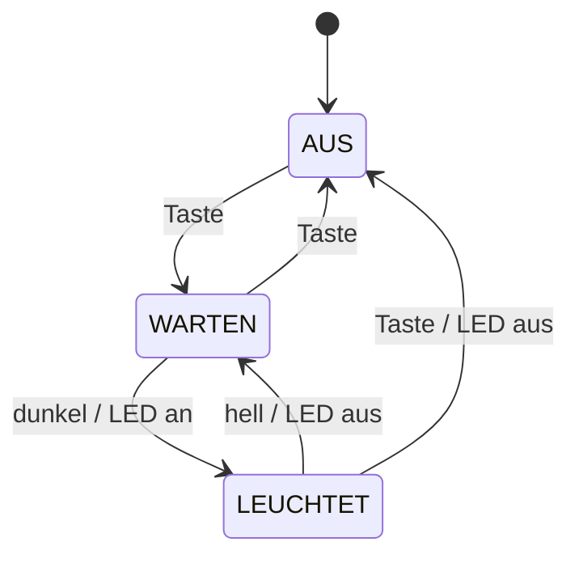
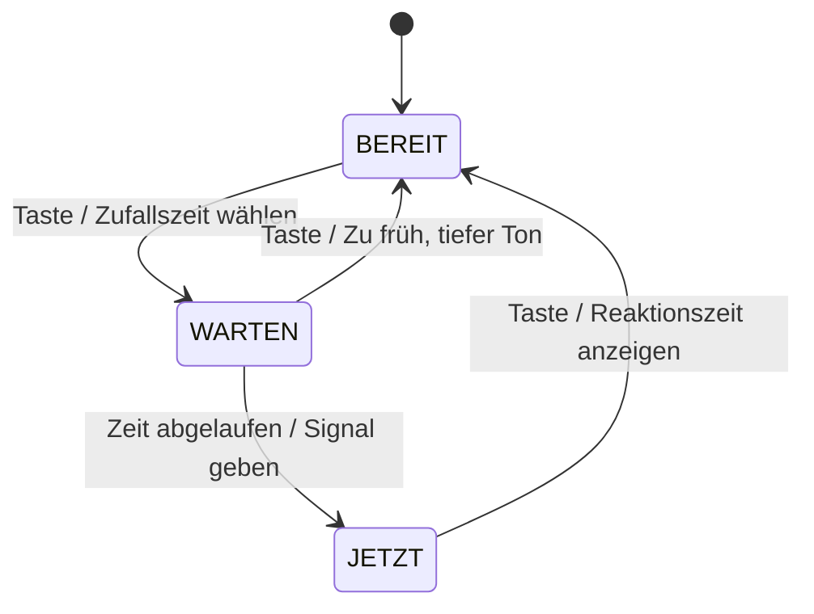

+++
title = "Woche 5 · Zustandsautomat und Experiment"
weight = 5
+++

**Heute:** Sprint 2 beginnt. Du übersetzt ein Zustandsdiagramm nach einem festen Rezept in Code, baust ein Reaktionsspiel und untersuchst im **Experiment**, wie sich das Verhalten eines interaktiven Systems ändert, wenn du Eingaben und Rückmeldungen variierst.

{}
- Du kannst ein Zustandsdiagramm mit dem **Automaten-Rezept** in Python umsetzen.
- Das Nachtlicht mit Aus-Taste läuft (am PC simuliert und/oder am Board).
- Du hast Reaktionszeiten unter verschiedenen Bedingungen gemessen und das Ergebnis erklärt.
- Euer eigenes Gadget hat einen Zustandsautomaten nach dem Rezept, mindestens für einen Teil der Zustände.
{}

## 1. Stand-up (5 min)

Sprint 2 hat begonnen: Welche Karten habt ihr nach dem Review ausgewählt? Wer nimmt welche?

## 2. Vom Diagramm zum Code (30 min)

### 2a · Das Automaten-Rezept

Jedes Gadget mit Zuständen kann dieselbe Struktur haben:

1. **Eine** Variable `zustand` hält den aktuellen Zustand.
2. Eine Funktion `naechster_zustand(zustand, ereignis)` enthält **genau die Pfeile** des Diagramms: ein `if`-Block pro Zustand, darin ein `if` pro ausgehendem Pfeil. Kein Pfeil passt? Zustand bleibt.
3. Die Hauptschleife: **Ereignis bestimmen → neuen Zustand berechnen → bei einem Wechsel die Ausgaben setzen**.

Zur Erinnerung, das Diagramm aus Woche 4:



### 2b · Am PC simulieren · `nachtlicht_pc.py`

Die Ereignisse tippst du ein, statt sie zu messen. So testest du die Logik ohne Hardware.

```python
def naechster_zustand(zustand, ereignis):
    """Die Pfeile des Zustandsdiagramms, sonst nichts."""
    if zustand == "AUS":
        if ereignis == "taste":
            return "WARTEN"
    elif zustand == "WARTEN":
        if ereignis == "taste":
            return "AUS"
        if ereignis == "dunkel":
            return "LEUCHTET"
    elif zustand == "LEUCHTET":
        if ereignis == "taste":
            return "AUS"
        if ereignis == "hell":
            return "WARTEN"
    return zustand                     # kein passender Pfeil: bleibt


zustand = "AUS"
print("Ereignisse: taste, dunkel, hell · q beendet")

while True:
    ereignis = input(zustand + " > ")
    if ereignis == "q":
        break
    neu = naechster_zustand(zustand, ereignis)
    if neu != zustand:
        print("  ", zustand, "→", neu, "| LED", "an" if neu == "LEUCHTET" else "aus")
        zustand = neu
```

**Probier aus:** Spiel das Diagramm Pfeil für Pfeil durch. Tippe auch Ereignisse, die in einem Zustand **keinen** Pfeil haben (z. B. `dunkel` im Zustand AUS).

### 2c · Auf dem Board · `main.py`

`naechster_zustand` wird **Zeichen für Zeichen** übernommen. Nur woher die Ereignisse kommen und was bei einem Wechsel passiert, ändert sich. Das Programm verwendet eure `hardware.py` aus Woche 4 und ist damit für alle Boards gleich.

```python
from hardware import *
import time

SCHWELLE = 30


def naechster_zustand(zustand, ereignis):
    if zustand == "AUS":
        if ereignis == "taste":
            return "WARTEN"
    elif zustand == "WARTEN":
        if ereignis == "taste":
            return "AUS"
        if ereignis == "dunkel":
            return "LEUCHTET"
    elif zustand == "LEUCHTET":
        if ereignis == "taste":
            return "AUS"
        if ereignis == "hell":
            return "WARTEN"
    return zustand


def ereignis_bestimmen():
    if gedrueckt():
        return "taste"
    if helligkeit() < SCHWELLE:
        return "dunkel"
    return "hell"


zustand = "AUS"
led(False)

while True:
    neu = naechster_zustand(zustand, ereignis_bestimmen())
    if neu != zustand:
        print(zustand, "→", neu)
        zustand = neu
        led(zustand == "LEUCHTET")
    time.sleep_ms(50)
```

**Ändere es · das Flackern beheben:** In Woche 4 hat die LED an der Grenze geflackert. Verwende **zwei** Schwellwerte: „dunkel" erst unter 25, „hell" erst über 35. Dazwischen gibt es **kein** Ereignis, der Zustand bleibt. (Fachwort: **Hysterese**, so arbeitet auch ein Thermostat.)

{}
```python
SCHWELLE_DUNKEL = 25
SCHWELLE_HELL = 35


def ereignis_bestimmen():
    if gedrueckt():
        return "taste"
    wert = helligkeit()
    if wert < SCHWELLE_DUNKEL:
        return "dunkel"
    if wert > SCHWELLE_HELL:
        return "hell"
    return None                        # Graubereich: kein Ereignis
```
`naechster_zustand` bleibt unverändert, weil `None` zu keinem Pfeil passt.
{}

{}
Die Pfeile lassen sich auch als **Dictionary** speichern. Der Schlüssel ist das Paar (Zustand, Ereignis), der Wert der neue Zustand. Dann ist der Code fast wörtlich das Diagramm:

```python
UEBERGAENGE = {
    ("AUS", "taste"): "WARTEN",
    ("WARTEN", "taste"): "AUS",
    ("WARTEN", "dunkel"): "LEUCHTET",
    ("LEUCHTET", "taste"): "AUS",
    ("LEUCHTET", "hell"): "WARTEN",
}


def naechster_zustand(zustand, ereignis):
    return UEBERGAENGE.get((zustand, ereignis), zustand)
```
Mehr zu Dictionaries: [Selbstlernen: Datenstrukturen]({}).
{}



## 3. Reaktionsspiel · `reaktion.py` (15 min)

Ein Automat, bei dem **Zeit** ein Ereignis ist. Auch dieses Programm ist mit eurer `hardware.py` für alle Boards gleich. Ohne Lichtsensor im Aufbau? Die Funktion `helligkeit` wird hier nicht gebraucht.



```python
from hardware import *
import time
import random

# Versuchsbedingungen für das Experiment
SIGNAL_LED = True
SIGNAL_TON = True
ZUFALLS_WARTEZEIT = True

zustand = "BEREIT"
startzeit = 0
wartezeit = 0
zeiten = []
print("Taste drücken zum Starten")

while True:
    taste = gedrueckt()
    jetzt = time.ticks_ms()

    if zustand == "BEREIT":
        if taste:
            wartezeit = random.randint(1000, 4000) if ZUFALLS_WARTEZEIT else 2000
            startzeit = jetzt
            zustand = "WARTEN"

    elif zustand == "WARTEN":
        if taste:
            print("Zu früh!")
            ton(220, 300)
            zustand = "BEREIT"
        elif time.ticks_diff(jetzt, startzeit) >= wartezeit:
            startzeit = time.ticks_ms()
            if SIGNAL_LED:
                led(True)
            if SIGNAL_TON:
                ton(880, 100)
            zustand = "JETZT"

    elif zustand == "JETZT":
        if taste:
            led(False)
            reaktion = time.ticks_diff(jetzt, startzeit)
            zeiten.append(reaktion)
            print("Versuch " + str(len(zeiten)) + ":", reaktion, "ms | Mittelwert:",
                  sum(zeiten) // len(zeiten), "ms")
            zustand = "BEREIT"

    time.sleep_ms(5)
```

`time.ticks_ms()` zählt Millisekunden seit dem Start des Boards, `time.ticks_diff(a, b)` rechnet sicher `a − b` aus.

**Spielt ein paar Runden.** Vergleicht das Programm mit dem Diagramm: Wo steckt jeder Pfeil im Code?

## 4. Experiment: Systemverhalten untersuchen (25 min)

Ein interaktives System besteht aus **Eingabe** (Taste), **Verarbeitung** (Automat) und **Rückmeldung** (LED, Ton). Wie schnell und wie zuverlässig ein Mensch damit umgeht, hängt stark von der Rückmeldung ab. Das messt ihr jetzt.

1. **Vermutung aufschreiben** (bevor ihr messt): Bei welcher Bedingung reagiert ihr am schnellsten? Warum?
2. **Messen:** Für jede Bedingung die Konstanten oben im Programm ändern, neu starten, **5 gültige Versuche** pro Person. Mittelwert und Anzahl „Zu früh!" notieren.

| # | `SIGNAL_LED` | `SIGNAL_TON` | `ZUFALLS_WARTEZEIT` | Mittelwert (ms) | „Zu früh!" |
|---|:---:|:---:|:---:|---:|---:|
| A | True | False | True | | |
| B | False | True | True | | |
| C | True | True | True | | |
| D | True | True | **False** | | |

3. **Erklären:** Stimmt eure Vermutung? Woran könnte der Unterschied zwischen A und B liegen? Was passiert bei D mit der Reaktionszeit, und was mit „Zu früh!"? Warum?
4. **Weiterdenken:** Welche Rückmeldung wäre für eine Person, die schlecht sieht, sinnvoll? Für eine, die schlecht hört?

{}
Viele Menschen reagieren auf einen **Ton** etwas schneller als auf ein **Lichtsignal**, weil das Gehirn akustische Reize schneller verarbeitet. Bei einer **festen Wartezeit** (D) lernt man den Rhythmus und drückt **vorausschauend**: Die gemessene Zeit wird kürzer, aber es gibt mehr Fehlstarts. Das Gerät misst dann nicht mehr die Reaktion, sondern das Raten. Eure Werte können anders aussehen: Ein paar Versuche sind eine kleine Stichprobe, und ein blockierender `ton()` oder die Schleifenpause verfälschen um einige Millisekunden. Genau solche Einflüsse gehören in die Erklärung.
{}

## 5. Auf euer Gadget übertragen (10 min)

Setzt euer eigenes Zustandsdiagramm aus Woche 4 mit dem Rezept um: zuerst `naechster_zustand` (am PC mit eingetippten Ereignissen testen), dann `ereignis_bestimmen` mit euren Sensoren. Beantwortet im Team:

- Welche **Rückmeldung** bekommt die Person, die euer Gadget benutzt, bei jedem Übergang?
- Was passiert bei einer **unerwarteten Eingabe** (Taste im falschen Moment, Sensor verdeckt)?

Neue Erkenntnisse als Karten auf das Kanban-Board.

## 6. Journalauftrag 5 (10 min)

{}
```markdown
# P1 · Woche 5 · <Datum>

## Vermutung
Was hast du vor dem Experiment erwartet?

## Messwerte
Die Tabelle A–D mit deinen Werten.

## Erklärung
Stimmt die Vermutung? Wie erklärst du die Unterschiede?
Was bedeutet das für die Rückmeldungen eures eigenen Gadgets?

## Automat
Ein Ausschnitt aus `naechster_zustand` eures Gadgets
und der passende Teil des Zustandsdiagramms.
```
{}

Commit-Nachricht: `P1 Woche 5: Automat und Experiment`.

## Quiz



Was gehört laut Automaten-Rezept in die Funktion `naechster_zustand`?
---
Alle Ausgaben wie `led()` und `ton()`.
Nur die Übergänge (Pfeile) des Zustandsdiagramms.
Das Lesen der Sensoren.
Die Hauptschleife.
---
Hält sich `naechster_zustand` von Hardware fern, kann man sie am PC testen und direkt mit dem Diagramm vergleichen.


Was liefert `naechster_zustand("LEUCHTET", "dunkel")` im Nachtlicht?
---
`"AUS"`
`"WARTEN"`
`"LEUCHTET"`
`None`
---
Aus LEUCHTET gibt es keinen Pfeil für „dunkel", also bleibt der Zustand. Die letzte Zeile `return zustand` sorgt dafür.


Warum hilft eine Hysterese (zwei Schwellwerte) gegen Flackern?
---
Im Bereich zwischen den Schwellen gibt es kein Ereignis, kleine Schwankungen lösen also keinen Wechsel mehr aus.
Der Sensor misst dadurch genauer.
Die Schleife läuft langsamer.
Die LED bekommt weniger Strom.
---
Erst ein deutlicher Helligkeitsunterschied schaltet um. Schwankungen um einen Wert herum bleiben ohne Wirkung.


Bei fester Wartezeit (Bedingung D) wird die gemessene Reaktionszeit oft kürzer. Was ist die beste Erklärung?
---
Das Board rechnet schneller.
Der Ton ist lauter.
Die Personen sind nach mehreren Versuchen einfach wacher.
Man lernt den Rhythmus und drückt vorausschauend, statt auf das Signal zu reagieren.
---
Deshalb steigt bei D meist auch die Zahl der Fehlstarts. Das System misst nicht mehr, was es messen soll.



## Bis nächste Woche

- Journalauftrag 5 committen.
- `naechster_zustand` eures Gadgets fertig und am PC durchgespielt.
- Nächste Woche: Testen, Code-Review, README und Präsentation vorbereiten. Die Präsentation ist in **zwei Wochen**.
