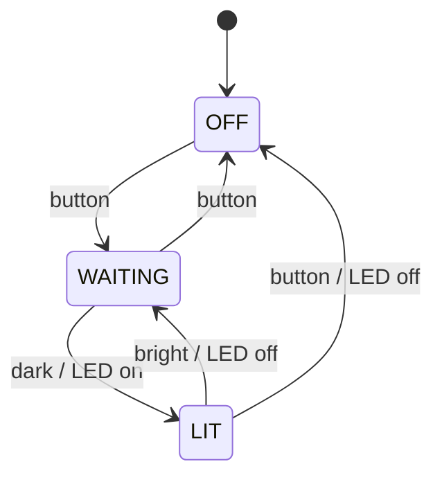
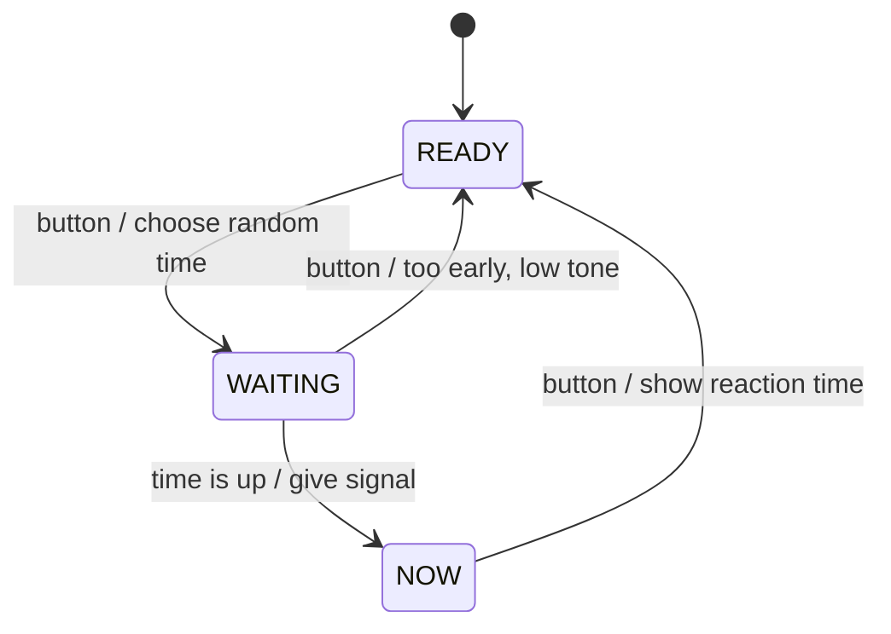

+++
title = "Week 5 · State Machine and Experiment"
weight = 5
+++

**Today:** sprint 2 begins. You translate a state diagram into code using a fixed recipe, build a reaction game, and investigate in an **experiment** how the behaviour of an interactive system changes when you vary inputs and feedback.

{}
- You can implement a state diagram in Python using the **state machine recipe**.
- The night light with an off button runs (simulated on the PC and/or on the board).
- You have measured reaction times under different conditions and explained the result.
- Your own gadget has a state machine following the recipe, at least for some of its states.
{}

## 1. Stand-up (5 min)

Sprint 2 has started: which cards did you choose after the review? Who takes which?

## 2. From diagram to code (30 min)

### 2a · The state machine recipe

Every gadget with states can have the same structure:

1. **One** variable `state` holds the current state.
2. A function `next_state(state, event)` contains **exactly the arrows** of the diagram: one `if` block per state, inside it one `if` per outgoing arrow. No arrow matches? The state stays.
3. The main loop: **determine event → compute new state → on a change, set the outputs**.

As a reminder, the diagram from week 4:



### 2b · Simulate on the PC · `nightlight_pc.py`

You type the events instead of measuring them. That way you test the logic without hardware.

```python
def next_state(state, event):
    """The arrows of the state diagram, nothing else."""
    if state == "OFF":
        if event == "button":
            return "WAITING"
    elif state == "WAITING":
        if event == "button":
            return "OFF"
        if event == "dark":
            return "LIT"
    elif state == "LIT":
        if event == "button":
            return "OFF"
        if event == "bright":
            return "WAITING"
    return state                       # no matching arrow: stays


state = "OFF"
print("Events: button, dark, bright · q quits")

while True:
    event = input(state + " > ")
    if event == "q":
        break
    new = next_state(state, event)
    if new != state:
        print("  ", state, "→", new, "| LED", "on" if new == "LIT" else "off")
        state = new
```

**Try it:** play through the diagram arrow by arrow. Also type events that have **no** arrow in a state (e.g. `dark` in state OFF).

### 2c · On the board · `main.py`

`next_state` is copied **character for character**. Only where the events come from and what happens on a change is different. The program uses your `hardware.py` from week 4 and is therefore the same for all boards.

```python
from hardware import *
import time

THRESHOLD = 30


def next_state(state, event):
    if state == "OFF":
        if event == "button":
            return "WAITING"
    elif state == "WAITING":
        if event == "button":
            return "OFF"
        if event == "dark":
            return "LIT"
    elif state == "LIT":
        if event == "button":
            return "OFF"
        if event == "bright":
            return "WAITING"
    return state


def determine_event():
    if pressed():
        return "button"
    if brightness() < THRESHOLD:
        return "dark"
    return "bright"


state = "OFF"
led(False)

while True:
    new = next_state(state, determine_event())
    if new != state:
        print(state, "→", new)
        state = new
        led(state == "LIT")
    time.sleep_ms(50)
```

**Change it · fix the flicker:** in week 4 the LED flickered at the border. Use **two** thresholds: "dark" only below 25, "bright" only above 35. In between there is **no** event and the state stays. (Technical term: **hysteresis**, which is how a thermostat works too.)

{}
```python
THRESHOLD_DARK = 25
THRESHOLD_BRIGHT = 35


def determine_event():
    if pressed():
        return "button"
    value = brightness()
    if value < THRESHOLD_DARK:
        return "dark"
    if value > THRESHOLD_BRIGHT:
        return "bright"
    return None                        # grey zone: no event
```
`next_state` stays unchanged, because `None` matches no arrow.
{}

{}
The arrows can also be stored in a **dictionary**. The key is the pair (state, event), the value is the new state. Then the code reads almost exactly like the diagram:

```python
TRANSITIONS = {
    ("OFF", "button"): "WAITING",
    ("WAITING", "button"): "OFF",
    ("WAITING", "dark"): "LIT",
    ("LIT", "button"): "OFF",
    ("LIT", "bright"): "WAITING",
}


def next_state(state, event):
    return TRANSITIONS.get((state, event), state)
```
More on dictionaries: [Self-study: Data Structures]({}).
{}

German video introducing finite state machines:



## Break (5 min)

## 3. Reaction game · `reaction.py` (15 min)

A state machine in which **time** is an event. With your `hardware.py`, this program is also the same for all boards. No light sensor in your setup? The `brightness` function is not needed here.



```python
from hardware import *
import time
import random

# Test conditions for the experiment
SIGNAL_LED = True
SIGNAL_TONE = True
RANDOM_WAIT = True

state = "READY"
start_time = 0
wait_time = 0
times = []
print("Press the button to start")

while True:
    button = pressed()
    now = time.ticks_ms()

    if state == "READY":
        if button:
            wait_time = random.randint(1000, 4000) if RANDOM_WAIT else 2000
            start_time = now
            state = "WAITING"

    elif state == "WAITING":
        if button:
            print("Too early!")
            tone(220, 300)
            state = "READY"
        elif time.ticks_diff(now, start_time) >= wait_time:
            start_time = time.ticks_ms()
            if SIGNAL_LED:
                led(True)
            if SIGNAL_TONE:
                tone(880, 100)
            state = "NOW"

    elif state == "NOW":
        if button:
            led(False)
            reaction = time.ticks_diff(now, start_time)
            times.append(reaction)
            print("Attempt " + str(len(times)) + ":", reaction, "ms | average:",
                  sum(times) // len(times), "ms")
            state = "READY"

    time.sleep_ms(5)
```

`time.ticks_ms()` counts milliseconds since the board started, `time.ticks_diff(a, b)` safely computes `a − b`.

**Play a few rounds.** Compare the program with the diagram: where is each arrow in the code?

## 4. Experiment: investigating system behaviour (25 min)

An interactive system consists of **input** (button), **processing** (state machine) and **feedback** (LED, tone). How quickly and reliably a person can use it depends a lot on the feedback. You are going to measure that now.

1. **Write down your hypothesis** (before measuring): under which condition will you react fastest? Why?
2. **Measure:** for each condition change the constants at the top of the program, restart, **5 valid attempts** per person. Note the average and the number of "Too early!".

| # | `SIGNAL_LED` | `SIGNAL_TONE` | `RANDOM_WAIT` | Average (ms) | "Too early!" |
|---|:---:|:---:|:---:|---:|---:|
| A | True | False | True | | |
| B | False | True | True | | |
| C | True | True | True | | |
| D | True | True | **False** | | |

3. **Explain:** was your hypothesis right? What could cause the difference between A and B? What happens to the reaction time in D, and what happens to "Too early!"? Why?
4. **Think further:** which feedback would make sense for a person with poor eyesight? For a person with poor hearing?

{}
Many people react a little faster to a **sound** than to a **light signal**, because the brain processes auditory stimuli faster. With a **fixed waiting time** (D) you learn the rhythm and press **in anticipation**: the measured time gets shorter, but there are more false starts. The device then no longer measures reaction but guessing. Your values may look different: a few attempts are a small sample, and a blocking `tone()` or the loop pause distorts the result by a few milliseconds. Exactly these influences belong in your explanation.
{}

## 5. Apply it to your gadget (10 min)

Implement your own state diagram from week 4 using the recipe: first `next_state` (test on the PC with typed events), then `determine_event` with your sensors. Answer as a team:

- Which **feedback** does the person using your gadget get at each transition?
- What happens with an **unexpected input** (button at the wrong moment, sensor covered)?

Put new insights as cards on the Kanban board.

## 6. Journal task 5 (10 min)

{}
```markdown
# P1 · Week 5 · <date>

## Hypothesis
What did you expect before the experiment?

## Measurements
The table A–D with your values.

## Explanation
Was the hypothesis right? How do you explain the differences?
What does this mean for the feedback of your own gadget?

## State machine
An excerpt from `next_state` of your gadget
and the matching part of the state diagram.
```
{}

Commit message: `P1 week 5: state machine and experiment`.

## Quiz



According to the state machine recipe, what belongs in the function `next_state`?
---
All outputs such as `led()` and `tone()`.
Only the transitions (arrows) of the state diagram.
Reading the sensors.
The main loop.
---
If `next_state` stays away from hardware, you can test it on the PC and compare it directly with the diagram.


What does `next_state("LIT", "dark")` return for the night light?
---
`"OFF"`
`"WAITING"`
`"LIT"`
`None`
---
There is no "dark" arrow from LIT, so the state stays. The last line `return state` takes care of that.


Why does hysteresis (two thresholds) help against flickering?
---
Between the thresholds there is no event, so small fluctuations no longer trigger a change.
The sensor measures more accurately.
The loop runs more slowly.
The LED gets less current.
---
Only a clear change in brightness switches the state. Fluctuations around one value have no effect.


With a fixed waiting time (condition D) the measured reaction time often gets shorter. What is the best explanation?
---
The board computes faster.
The tone is louder.
People are simply more awake after several attempts.
You learn the rhythm and press in anticipation instead of reacting to the signal.
---
That is also why D usually has more false starts. The system no longer measures what it is supposed to measure.



## Until next week

- Commit journal task 5.
- `next_state` of your gadget finished and played through on the PC.
- Next week: testing, code review, README and preparing the presentation. The presentation is in **two weeks**.
