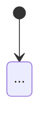

+++
title = "Woche 6 · Testen, Code-Review, Präsentation"
weight = 6
+++

**Heute:** Ihr macht das Gadget fertig und belastbar: Logik automatisch testen, Gerät nach Protokoll prüfen, Code gegenseitig begutachten, README schreiben und die Präsentation für nächste Woche vorbereiten.

{}
- Die Logik eures Gadgets steckt in `logik.py` und wird von `test_logik.py` am PC geprüft.
- `TESTS.md` enthält ein Testprotokoll des echten Geräts.
- Ein anderes Team hat euren Code begutachtet, ihr habt die wichtigsten Punkte verbessert.
- `README.md` im Team-Repository beschreibt das Gadget vollständig.
- Die 3-Minuten-Präsentation ist geplant und einmal geprobt.
{}

## 1. Stand-up (5 min)

Zusätzlich heute: **Was muss bis zum Review unbedingt noch fertig werden, was streichen wir?** Karten, die nicht mehr realistisch sind, zurück in den Backlog. Ein kleines Gadget, das zuverlässig läuft, schlägt ein großes, das bei der Vorführung abstürzt.

## 2. Logik testen ohne Hardware (20 min)

### 2a · Drei Dateien

Euer Projekt bekommt seine endgültige Struktur:

| Datei | Inhalt | läuft auf |
|-------|--------|-----------|
| `hardware.py` | Pins, Sensoren, Aktoren (Woche 4) | nur Board |
| `logik.py` | `naechster_zustand` und andere Funktionen **ohne** Hardware | Board **und** PC |
| `main.py` | Hauptschleife: Ereignis bestimmen → `naechster_zustand` → Ausgaben | nur Board |

`logik.py` für das Nachtlicht:

```python
# logik.py – keine Imports von hardware!

def naechster_zustand(zustand, ereignis):
    if zustand == "AUS":
        if ereignis == "taste":
            return "WARTEN"
    elif zustand == "WARTEN":
        if ereignis == "taste":
            return "AUS"
        if ereignis == "dunkel":
            return "LEUCHTET"
    elif zustand == "LEUCHTET":
        if ereignis == "taste":
            return "AUS"
        if ereignis == "hell":
            return "WARTEN"
    return zustand
```

In `main.py` ersetzt ihr die Funktion durch `from logik import naechster_zustand`. `logik.py` muss auch auf dem Board gespeichert sein.

### 2b · `test_logik.py`

Jeder Pfeil im Zustandsdiagramm wird ein Testfall, dazu ein paar Fälle **ohne** Pfeil. Speichert `logik.py` und `test_logik.py` im selben Ordner **am PC** und startet den Test in Thonny mit dem Interpreter **Lokales Python 3**.

```python
# test_logik.py – läuft am PC
from logik import naechster_zustand

TESTS = [
    # (Zustand,   Ereignis, erwarteter neuer Zustand)
    ("AUS",      "taste",  "WARTEN"),
    ("WARTEN",   "taste",  "AUS"),
    ("WARTEN",   "dunkel", "LEUCHTET"),
    ("LEUCHTET", "hell",   "WARTEN"),
    ("LEUCHTET", "taste",  "AUS"),
    # Ereignisse ohne Pfeil: Zustand bleibt
    ("AUS",      "dunkel", "AUS"),
    ("WARTEN",   "hell",   "WARTEN"),
    ("LEUCHTET", "dunkel", "LEUCHTET"),
]

bestanden = 0
for zustand, ereignis, erwartet in TESTS:
    ergebnis = naechster_zustand(zustand, ereignis)
    if ergebnis == erwartet:
        bestanden = bestanden + 1
        print("ok     ", zustand, "+", ereignis, "→", ergebnis)
    else:
        print("FEHLER ", zustand, "+", ereignis, "→", ergebnis, "erwartet:", erwartet)

print(bestanden, "von", len(TESTS), "Tests bestanden")
```

**Probier aus:**

1. Alle Tests grün? Dann baue **absichtlich einen Fehler** in `logik.py` ein (z. B. `return "AUS"` statt `return "WARTEN"`). Findet der Test ihn?
2. Schreibt `logik.py` und `test_logik.py` für **euer** Gadget. Ein Testfall pro Pfeil eures Diagramms.

{}
Profis schreiben Tests oft mit `assert`: Die Zeile tut nichts, wenn die Bedingung stimmt, und bricht mit `AssertionError` ab, wenn nicht.

```python
assert naechster_zustand("AUS", "taste") == "WARTEN"
assert naechster_zustand("AUS", "dunkel") == "AUS"
print("alle Tests bestanden")
```
{}

### 2c · Testprotokoll am Gerät

Nicht alles lässt sich am PC testen: Wackelkontakte, Schwellwerte, Tonlautstärke. Dafür gibt es das **Testprotokoll**, eine Tabelle in `TESTS.md`. Eine Person bedient, eine liest vor und trägt ein. Grundlage sind eure Akzeptanzkriterien aus `ANFORDERUNGEN.md`.

```markdown
| # | Ausgangszustand | Aktion | Erwartet | Beobachtet | ok? |
|---|-----------------|--------|----------|------------|-----|
| 1 | AUS, Raum hell | Taste drücken | WARTEN, LED aus | LED aus | ✅ |
| 2 | WARTEN | Hand über Sensor | LED an innerhalb 1 s | LED an nach ca. 0,5 s | ✅ |
| 3 | LEUCHTET | Taste drücken | AUS, LED aus | LED bleibt an | ❌ |
```

Jeder ❌ wird eine Karte auf dem Kanban-Board.

## 3. Code-Review im Teamtausch (20 min)

Zwei Teams tauschen die Plätze und lesen gegenseitig den Code (10 min pro Richtung). Die Gutachter:innen schreiben ihre Punkte als **Issue** ins Team-Repository des anderen Teams (Reiter **Issues → New issue**) oder auf Zettel.

{}
1. **Läuft es?** `main.py` startet ohne Fehler, `test_logik.py` ist grün.
2. **Passt der Code zum Diagramm?** Jeder Pfeil ist in `naechster_zustand` zu finden, und umgekehrt.
3. **Namen:** Sagen Variablen- und Funktionsnamen, was drin ist? (`schwelle_dunkel` statt `x`)
4. **Keine magischen Zahlen:** Pins, Schwellwerte, Zeiten stehen als KONSTANTEN oben oder in `hardware.py`.
5. **Kommentare** erklären das **Warum**, nicht das Was. (`# Hysterese gegen Flackern`, nicht `# x um 1 erhöhen`)
6. **Kurze Funktionen:** Keine Funktion ist länger als eine Bildschirmseite.
7. **Eine Sache**, die euch besonders gut gefällt.
{}

Punkte 1–2 sind Pflicht vor der Präsentation. Den Rest verbessert ihr, soweit Zeit bleibt. Mehr dazu, wie man Code systematisch verbessert: [Selbstlernen: Code-Qualität]({}).

## 4. README: die Visitenkarte des Projekts (15 min)

Die `README.md` ist das Erste, was man im Repository sieht. Sie ist später auch die Grundlage für die Projektseite in eurem [Web-Portfolio (P5)]({}).

````markdown
# <Name des Gadgets>

<Ein Satz: Was macht es, für wen?>


## Funktionen
- <die fertigen User Stories in einem Satz je Story>

## Hardware
| Bauteil | Anschluss |
|---------|-----------|
| <Board> | – |
| <Taste> | <Pin> ↔ GND |

## Starten
1. `hardware.py`, `logik.py` und `main.py` auf das Board kopieren.
2. Board einstecken, das Programm startet automatisch.

## Zustandsdiagramm


## Tests
`test_logik.py` am PC ausführen. Testprotokoll: [TESTS.md](TESTS.md)

## Team
<Namen oder GitHub-Benutzernamen, wer hat was gemacht>

## Quellen
- <Links zu Anleitungen und Code, die ihr verwendet habt>
- Fotos: eigene Aufnahmen
````

{}
Code, Bilder oder Schaltpläne aus dem Internet dürft ihr nur verwenden, wenn die Lizenz es erlaubt, und ihr müsst die **Quelle nennen**. Fotos von Personen nur mit deren Zustimmung. Das gilt ab jetzt für jedes Projekt.
{}

## 5. Präsentation vorbereiten (25 min)

Nächste Woche hat jedes Team **3 Minuten** plus 2 Minuten Fragen. Keine Folienschlacht: Das Gadget ist der Star.

| Zeit | Inhalt | Tipp |
|------|--------|------|
| 0:30 | **Problem und Idee:** Für wen, wozu? | mit einer Alltagssituation beginnen |
| 1:00 | **Live-Demo** | vorher üben, wer was drückt. Die Demo folgt einer User Story. |
| 0:45 | **Zustandsdiagramm** und ein **Code-Ausschnitt**, auf den ihr stolz seid | groß genug für die letzte Reihe |
| 0:30 | **Gelernt und schwierig:** ein echter Stolperstein und wie ihr ihn gelöst habt | ehrlich, nicht „alles super" |
| 0:15 | **Ausblick:** Was würdet ihr als Nächstes bauen? | |

{}
Nehmt heute ein **Handyvideo** (30 s) von der funktionierenden Demo auf. Wenn am Präsentationstag ein Kabel streikt, zeigt ihr das Video und erklärt, was schiefging. Das ist keine Schande, sondern Alltag in der Technik.
{}

**Einmal proben** mit Stoppuhr, ein anderes Team schaut zu und sagt: Was war unklar? War es unter 3 Minuten?

## 6. Journalauftrag 6 (10 min)

{}
```markdown
# P1 · Woche 6 · <Datum>

## Ein Fehler, den wir gefunden haben
Wie ist er aufgefallen (Test, Testprotokoll, Code-Review, Zufall)?
Was war die Ursache, wie habt ihr ihn behoben?

## Code-Review
Das nützlichste Feedback zu eurem Code, und ein Punkt,
den du selbst beim anderen Team gelernt hast.

## Meine Rolle
Was ist dein Beitrag zum Gadget? Verlinke einen Commit oder eine Datei.
```
{}

Commit-Nachricht: `P1 Woche 6: Tests und Review`.

## Quiz



Warum darf `logik.py` nichts aus `hardware.py` importieren?
---
Weil Python zirkuläre Imports verbietet.
Damit die Datei kleiner ist.
Damit `logik.py` am PC ohne Board ausgeführt und getestet werden kann.
Weil `hardware.py` nur einmal importiert werden darf.
---
Am PC gibt es kein `machine`- oder `microbit`-Modul. Ein Import davon würde den Test sofort abbrechen.


Das Zustandsdiagramm hat 5 Pfeile. Wie viele Testfälle braucht `test_logik.py` mindestens?
---
1
5, einen pro Pfeil, und besser noch ein paar für Ereignisse ohne Pfeil.
So viele, wie `logik.py` Zeilen hat.
Keinen, wenn das Gerät funktioniert.
---
Jeder Pfeil ist ein Verhalten, das stimmen muss. Die Fälle ohne Pfeil prüfen, dass nichts Ungewolltes passiert.


Welcher Kommentar ist am hilfreichsten?
---
`# Variable schwelle`
`# if-Abfrage`
`# schwelle um 5 erhöhen`
`# zwei Schwellen, damit die LED an der Grenze nicht flackert`
---
Was der Code tut, sieht man am Code. Ein guter Kommentar erklärt, **warum** er so geschrieben ist.


Was gehört **nicht** ins Testprotokoll am Gerät?
---
Wie viele Zeilen Code das Programm hat.
Der Ausgangszustand.
Was erwartet wurde.
Was tatsächlich beobachtet wurde.
---
Das Protokoll vergleicht erwartetes und beobachtetes Verhalten in einer bestimmten Situation. Codeumfang sagt darüber nichts.



## Bis nächste Woche

- Journalauftrag 6 committen.
- Offene ❌ aus dem Testprotokoll beheben, `README.md` fertigstellen.
- Präsentation zu Hause noch einmal durchgehen, Plan-B-Video ins Team-Repository legen.
