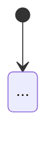

+++
title = "Week 6 · Testing, Code Review, Presentation"
weight = 6
+++

**Today:** you make the gadget finished and robust: test the logic automatically, check the device against a test report, review each other's code, write the README and prepare next week's presentation.

{}
- Your gadget's logic lives in `logic.py` and is checked on the PC by `test_logic.py`.
- `TESTS.md` contains a test report for the real device.
- Another team has reviewed your code, and you have improved the most important points.
- `README.md` in the team repository describes the gadget completely.
- The 3-minute presentation is planned and rehearsed once.
{}

## 1. Stand-up (5 min)

Additionally today: **what absolutely has to be finished before the review, and what do we drop?** Cards that are no longer realistic go back into the backlog. A small gadget that works reliably beats a big one that crashes during the demo.

## 2. Testing logic without hardware (20 min)

### 2a · Three files

Your project gets its final structure:

| File | Contents | runs on |
|------|----------|---------|
| `hardware.py` | pins, sensors, actuators (week 4) | board only |
| `logic.py` | `next_state` and other functions **without** hardware | board **and** PC |
| `main.py` | main loop: determine event → `next_state` → outputs | board only |

`logic.py` for the night light:

```python
# logic.py – no imports from hardware!

def next_state(state, event):
    if state == "OFF":
        if event == "button":
            return "WAITING"
    elif state == "WAITING":
        if event == "button":
            return "OFF"
        if event == "dark":
            return "LIT"
    elif state == "LIT":
        if event == "button":
            return "OFF"
        if event == "bright":
            return "WAITING"
    return state
```

In `main.py` you replace the function with `from logic import next_state`. `logic.py` must also be saved on the board.

### 2b · `test_logic.py`

Every arrow in the state diagram becomes a test case, plus a few cases **without** an arrow. Save `logic.py` and `test_logic.py` in the same folder **on the PC** and run the test in Thonny with the interpreter **Local Python 3**.

```python
# test_logic.py – runs on the PC
from logic import next_state

TESTS = [
    # (state,    event,    expected new state)
    ("OFF",     "button", "WAITING"),
    ("WAITING", "button", "OFF"),
    ("WAITING", "dark",   "LIT"),
    ("LIT",     "bright", "WAITING"),
    ("LIT",     "button", "OFF"),
    # events without an arrow: state stays
    ("OFF",     "dark",   "OFF"),
    ("WAITING", "bright", "WAITING"),
    ("LIT",     "dark",   "LIT"),
]

passed = 0
for state, event, expected in TESTS:
    result = next_state(state, event)
    if result == expected:
        passed = passed + 1
        print("ok    ", state, "+", event, "→", result)
    else:
        print("FAILED", state, "+", event, "→", result, "expected:", expected)

print(passed, "of", len(TESTS), "tests passed")
```

**Try it:**

1. All tests green? Then **deliberately introduce a bug** into `logic.py` (e.g. `return "OFF"` instead of `return "WAITING"`). Does the test find it?
2. Write `logic.py` and `test_logic.py` for **your** gadget. One test case per arrow in your diagram.

{}
Professionals often write tests with `assert`: the line does nothing if the condition holds, and stops with an `AssertionError` if it does not.

```python
assert next_state("OFF", "button") == "WAITING"
assert next_state("OFF", "dark") == "OFF"
print("all tests passed")
```
{}

### 2c · Test report on the device

Not everything can be tested on the PC: loose contacts, thresholds, tone volume. That is what the **test report** is for, a table in `TESTS.md`. One person operates the device, one reads out and records. It is based on your acceptance criteria from `REQUIREMENTS.md`.

```markdown
| # | Starting state | Action | Expected | Observed | ok? |
|---|----------------|--------|----------|----------|-----|
| 1 | OFF, room bright | press button | WAITING, LED off | LED off | ✅ |
| 2 | WAITING | hand over sensor | LED on within 1 s | LED on after approx. 0.5 s | ✅ |
| 3 | LIT | press button | OFF, LED off | LED stays on | ❌ |
```

Every ❌ becomes a card on the Kanban board.

## 3. Code review with another team (20 min)

Two teams swap places and read each other's code (10 min each way). The reviewers write their points as an **issue** in the other team's repository (tab **Issues → New issue**) or on paper.

{}
1. **Does it run?** `main.py` starts without errors, `test_logic.py` is green.
2. **Does the code match the diagram?** Every arrow can be found in `next_state`, and vice versa.
3. **Names:** do variable and function names say what is inside? (`threshold_dark` instead of `x`)
4. **No magic numbers:** pins, thresholds and times are CONSTANTS at the top or in `hardware.py`.
5. **Comments** explain **why**, not what. (`# hysteresis against flicker`, not `# increase x by 1`)
6. **Short functions:** no function is longer than one screen.
7. **One thing** you particularly like.
{}

Points 1–2 are mandatory before the presentation. Improve the rest as far as time allows. More on improving code systematically: [Self-study: Code Quality]({}).

## Break (5 min)

## 4. README: the project's business card (15 min)

The `README.md` is the first thing people see in the repository. Later it is also the basis for the project page in your [web portfolio (P5)]({}).

````markdown
# <Name of the gadget>

<One sentence: what does it do, for whom?>


## Features
- <the finished user stories, one sentence per story>

## Hardware
| Component | Connection |
|-----------|------------|
| <board> | – |
| <button> | <pin> ↔ GND |

## Getting started
1. Copy `hardware.py`, `logic.py` and `main.py` onto the board.
2. Plug in the board, the program starts automatically.

## State diagram


## Tests
Run `test_logic.py` on the PC. Test report: [TESTS.md](TESTS.md)

## Team
<names or GitHub usernames, who did what>

## Sources
- <links to guides and code you used>
- Photos: our own
````

{}
You may only use code, images or circuit diagrams from the internet if the licence allows it, and you must **name the source**. Photos of people only with their consent. From now on this applies to every project.
{}

## 5. Prepare the presentation (25 min)

Next week each team has **3 minutes** plus 2 minutes of questions. No slide marathon: the gadget is the star.

| Time | Content | Tip |
|------|---------|-----|
| 0:30 | **Problem and idea:** for whom, what for? | start with an everyday situation |
| 1:00 | **Live demo** | practise beforehand who presses what. The demo follows a user story. |
| 0:45 | **State diagram** and a **code excerpt** you are proud of | large enough for the back row |
| 0:30 | **Learned and difficult:** a real stumbling block and how you solved it | honest, not "everything was great" |
| 0:15 | **Outlook:** what would you build next? | |

{}
Record a **phone video** (30 s) of the working demo today. If a cable gives up on presentation day, show the video and explain what went wrong. That is nothing to be ashamed of, it happens in engineering all the time.
{}

**Rehearse once** with a stopwatch while another team watches and tells you: what was unclear? Was it under 3 minutes?

## 6. Journal task 6 (10 min)

{}
```markdown
# P1 · Week 6 · <date>

## A bug we found
How was it noticed (test, test report, code review, chance)?
What was the cause, how did you fix it?

## Code review
The most useful feedback on your code, and one thing
you learned yourself from the other team's code.

## My role
What is your contribution to the gadget? Link a commit or a file.
```
{}

Commit message: `P1 week 6: tests and review`.

## Quiz



Why must `logic.py` not import anything from `hardware.py`?
---
Because Python forbids circular imports.
So that the file is smaller.
So that `logic.py` can be run and tested on the PC without a board.
Because `hardware.py` may only be imported once.
---
There is no `machine` or `microbit` module on the PC. Importing one would stop the test immediately.


The state diagram has 5 arrows. How many test cases does `test_logic.py` need at least?
---
1
5, one per arrow, and preferably a few more for events without an arrow.
As many as `logic.py` has lines.
None, if the device works.
---
Every arrow is a behaviour that has to be right. The cases without an arrow check that nothing unwanted happens.


Which comment is most helpful?
---
`# variable threshold`
`# if statement`
`# increase threshold by 5`
`# two thresholds so the LED does not flicker at the border`
---
You can see what the code does by reading the code. A good comment explains **why** it is written that way.


What does **not** belong in the test report for the device?
---
How many lines of code the program has.
The starting state.
What was expected.
What was actually observed.
---
The report compares expected and observed behaviour in a specific situation. The amount of code says nothing about that.



## Until next week

- Commit journal task 6.
- Fix the open ❌ from the test report, finish `README.md`.
- Go through the presentation once more at home, put the plan B video into the team repository.
